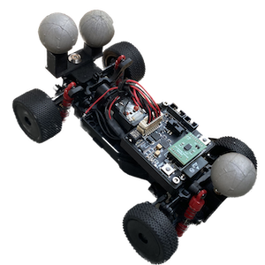

<div align="center">
  <br />
  <b>Chronos Race Car Firmware</b>
</div>


The [CRS platform](https://gitlab.ethz.ch/ics-group/projects/andrea/crs-2.0) can run hardware experiments on small-scale race cars (_Chronos_) with custom electronics. This repository contains the firmware running on a custom-built PCB. It is a C/C++ project based on the [ESP-IDF development framework](https://github.com/espressif/esp-idf/) for the ESP32 microcontroller family.


# Table of Contents

[[_TOC_]]


# Getting Started

## Flashing the firmware

The cars at the CRS lab are usually already flashed with working firmware. Sometimes, it may be necessary to upgrade the firmware, which can be done by flashing the microcontroller with one of the [latest release binaries](https://gitlab.ethz.ch/ics-group/students/lukas-vogel/crs-wifi-car-firmware/-/releases).

1. Prepare the flashing toolchain
    ```console
    source ./setup flash
    ```

2. [Obtain the binary files](https://gitlab.ethz.ch/ics-group/students/lukas-vogel/crs-wifi-car-firmware/-/releases) (`bootloader.bin`, `partition-table.bin` and `car-firmware.bin`) from the latest release, or message one of the developers.

3. Unplug the ribbon cable from the car's PCB, if it is still attached.

4. Connect the ESP-PROG board to your computer using a USB to microUSB cable.

5. Connect the ESP-PROG board to the PCB using the small PROG ribbon cable.

6. Open a terminal on your computer and navigate to the location where the binary files are stored.

7. Find out which serial port was opened from the PROG board (`ls /dev/tty*`). Note that the PROG opens *two* serial ports, you need to one with the larger number _n + 1_ (e.g., `/dev/ttyUSB1`).

8. Run the following command, replacing `(PORT)` with the port number you found in the previous step (e.g., `/dev/ttyUSB1`).
    ```console
    esptool.py -p (PORT) -b 460800 --before default_reset --after hard_reset --chip esp32 write_flash --flash_mode dio --flash_size detect --flash_freq 40m 0x1000 ./bootloader.bin 0x8000 ./partition-table.bin 0x10000 ./car-firmware.bin
    ```

9. Wait for the flashing process to complete. Remove all cables and re-connect PCB to ribbon cable.

## Development

Development on the firmware requires the ESP-IDF toolchain. A development container and a native environment are both supported. See the [page on contributing](./CONTRIBUTING.md) for more information.

# Documentation

The code is documented using Doxygen within the source files themselves. If you would like a browsable version of the documentation, install and run [Doxygen](https://www.doxygen.nl/).

`````shell
cd crs-wifi-car-firmware
doxygen Doxyfile
`````

The documentation will be generated in the `docs/` folder.

# Code Overview

The ESP-IDF toolchain has a CMake-based build system and allows separating out different parts of the code into separate components with dependencies. The entire firmware of the car can be found in `src/`. If you're looking for a specific part of the code, here's a quick overview of what's located where:

* `src/`: root folder of the firmware
  * `main/`: main component, containing the entry point (`app_main()`)
  * `rtos/`: where the car's RTOS features are handled, task creation and semaphore implementations
  * `communication`: high-level communication (transport and application layer)
  * `configuration`: persistence of configuration settings and the configuration server
  * `control`: control loop and different controllers for low-level input quantities
  * `hardware`: drivers that interact with hardware components, i.e. actuators, sensors or Wi-Fi
  * `interfaces`: hardware abstractions so that higher level components like `control` could be easily ported to different platforms
  * `state`: state machine that tracks the high-level operational states of the vehicle
  * `util`: utility functions

# Developers

[Lukas Vogel](mailto:vogellu@ethz.ch)
