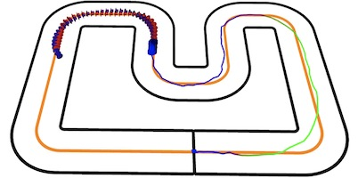
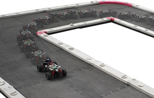
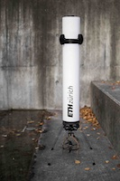

<div align="center">
  &emsp;
  &emsp;
  

  <h1>CRS Project</h1>

  <a href="https://gitlab.ethz.ch/ics-group/projects/andrea/crs-2.0/-/pipelines">
    
  </a>
  <a href="https://opensource.org/licenses/BSD-2-Clause">
    
  </a>
</div>

---

The Control and Robotics Software (CRS), an advanced control software framework to support simulations and experiments in the fields of control and robotics. The software packages include optimization-based system identification, state estimation, and control algorithms, empowering researchers and students to explore complex control strategies.

CRS is built on top of the Robot Operating System (ROS) and primarily written in C++ and Python.

## Table of Contents
[[_TOC_]]

## Getting Started

We recommend to running CRS in a containerized environment. Instructions on how to build and run the CRS Docker image can be found in the [Install Wiki](https://gitlab.ethz.ch/ics/crs/-/wikis/getting_started/installation). After the installation, have a look at the [First Steps](https://gitlab.ethz.ch/ics/crs/-/wikis/getting_started/First-Steps) and the [rest of the documentation](https://gitlab.ethz.ch/ics/crs/-/wikis/home).

```console
# To run the setup script on Ubuntu
[crs-2.0]$ cd ./.setup/ubuntu
[crs-2.0]$ sudo ./setup.sh
```

### Example Experiments

1. Build the CRS Docker image and run it
```console
[crs-2.0]$ crs-docker up && crs-docker run
```

2. Build all packages (inside the container)
```console
crs build && source devel/setup.bash
```

3. Run a simulation experiment with a single car using an MPCC on a Pacejka dynamic model
```console
roslaunch crs_launch sim_single_car.launch experiment_name:=pacejka_mpc
```

Many more experiments are available in the [experiments](./experiments) folder! Further, many more [configuration options and arguments](https://gitlab.ethz.ch/ics-group/projects/andrea/crs-2.0/-/wikis/getting_started/experiments) can be passed to the launch files.

### Optimization-based System Identification

Have a look at the Jupyter notebooks in [_src/ros4crs/tools/opt_sys_id/notebooks_](./src/ros4crs/tools/opt_sys_id/notebooks) to get started with optimization-based system identification.

Two example datasets are already provided, and the notebooks are easily extended for a custom dataset.

### Additional Examples

A few additional examples:

#### Bypass State Estimation
```bash
 roslaunch crs_launch sim_single_car.launch experiment_name:=example_experiment bypass_estimator:=true
```
#### Substituting RViz with PlotJuggler
```bash
 roslaunch crs_launch sim_single_car.launch experiment_name:=example_experiment view_rviz:=false view_plotjuggler:=true
```

#### With Backtracker to recover from crashes
```bash
 roslaunch crs_launch sim_single_car.launch experiment_name:=example_experiment use_backtracker:=true
```

#### With Custom Simulator config
```bash
 roslaunch crs_launch sim_single_car.launch experiment_name:=example_experiment simulator_config:=<absolute_path_to_config.yaml>
```

#### With different Track
(Note, you will also need to adjust starting position in model.yaml. Track config is located at ros/tools/track_generation/tracks)
```bash
 roslaunch crs_launch sim_single_car.launch experiment_name:=example_experiment track_name:=LONG_TRACK
```

## Contributing

We welcome contributions to the CRS project. If you intend to develop code for this project, please read the [best practices](https://gitlab.ethz.ch/ics-group/projects/andrea/crs-2.0/-/wikis/development/best-practices) and [guidelines](https://gitlab.ethz.ch/ics-group/projects/andrea/crs-2.0/-/wikis/development/guidelines) first.

## Developers

[Sabrina Bodmer](@sabodmer) &ensp; [Alex Hansson](@ahansson) &ensp; [Joshua Näf](@naefjo) &ensp; [Lukas Vogel](@vogellu)

### Principal Developers
[Jerome Sieber](@jsieber) &nbsp;  &nbsp; [Simon Muntwiler](@simonmu) &nbsp;  &nbsp; [Andrea Carron](@carrona)

### CRS Hall of Fame

 &ensp;  &ensp; 

[Robin Frauenfelder](@robinfr) &ensp; [David Helm](@helmd) &ensp; [Christian Küttel](@kuettelc) &ensp; [Daniel Mesham](@dmesham) &ensp; [Rahel Rickenbach](@rrahel) &ensp; [Ben Tearle](@btearle) &ensp; [René Zurbruegg](@zrene)
